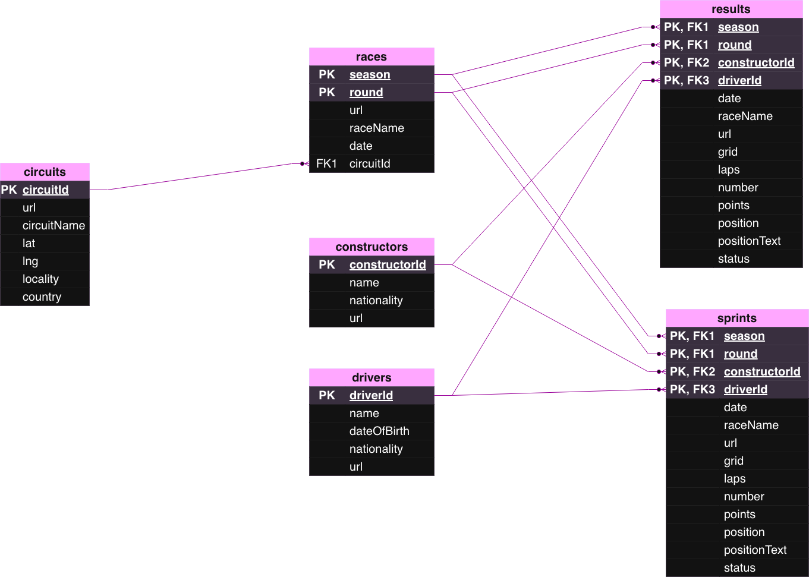
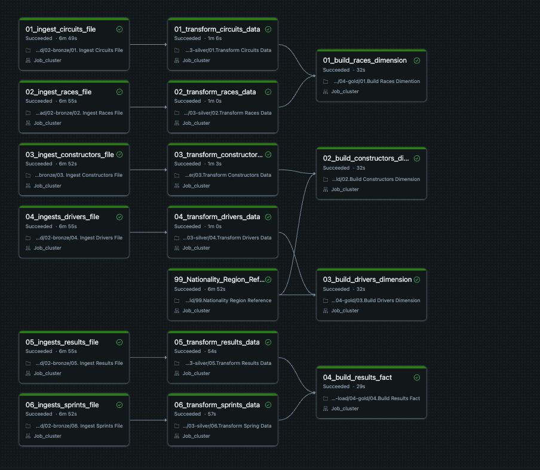
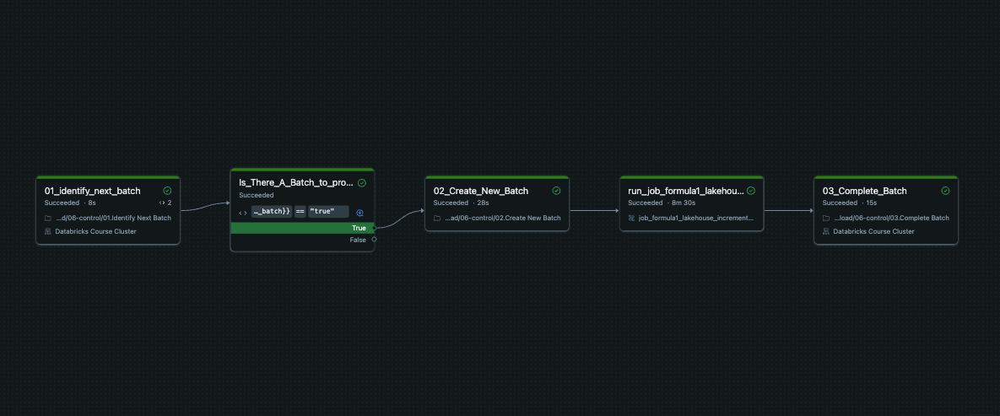
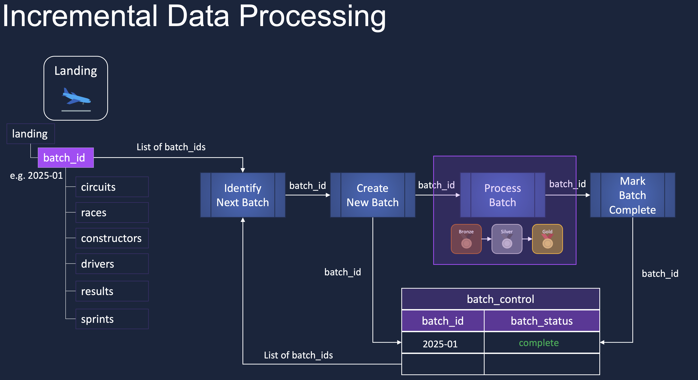

# Formula 1 End-to-End Data Engineering Pipeline

Cloud-based end-to-end data engineering pipeline built using Azure Databricks, PySpark, Delta Lake, Unity Catalog, Lakeflow Jobs, and Azure Data Lake Storage Gen2.

The project follows a Medallion Architecture (Bronze → Silver → Gold) and implements scalable batch processing, incremental ingestion, orchestration workflows, and analytical data modeling using Formula 1 racing datasets.

---

## Project Overview

This project simulates a production-style Data Engineering workflow:

- Ingest raw Formula 1 datasets into Bronze layer
- Clean and transform data in Silver layer
- Build dimensional models and fact tables in Gold layer
- Implement incremental processing using batch control logic
- Orchestrate notebook dependencies using Databricks Lakeflow Jobs
- Create analytical views for downstream reporting

---

## Raw Data Schema



---

## Architecture



---

## Incremental Processing Workflow

This project supports incremental processing using control tables and workflow state tracking.



Features:

- Batch identification logic
- Batch lifecycle management
- Status tracking (`in_progress`, `completed`)
- Lakeflow task orchestration
- Pipeline state management

---

## Medallion Architecture



### Bronze Layer

Raw ingestion layer:

- Circuits
- Drivers
- Constructors
- Results
- Races
- Sprint data

### Silver Layer

Transformation and standardization layer:

- Data cleansing
- Schema enforcement
- Metadata columns
- Incremental filtering
- Business transformations

### Gold Layer

Business-ready analytical layer:

- `dim_drivers`
- `dim_constructors`
- `dim_races`
- `fact_session_results`
- `ref_nationality_region`

---

## Data Model

### Silver Schema


### Gold Schema


---

## Technologies Used

- Azure Databricks
- PySpark
- Spark SQL
- Delta Lake
- Unity Catalog
- Lakeflow Jobs
- Azure Data Lake Storage Gen2
- Python
- SQL
- Databricks SQL
- Medallion Architecture

---

## Project Structure

```text
notebooks/

00-common/      Shared helpers and configuration
01-setup/       Environment setup
02-bronze/      Raw data ingestion
03-silver/      Data transformations
04-gold/        Dimensional modeling
05-analytics/   Analytical views
06-control/     Incremental orchestration
07-images/      Project images and diagrams
```

---

## Key Data Engineering Concepts

- Incremental processing
- Delta Lake merge operations
- Control tables
- Batch lifecycle tracking
- Data Lakehouse architecture
- Medallion architecture
- Orchestration workflows
- Dimensional modeling
- Reusable helper functions
- Unity Catalog governance

---

## Future Improvements

- Add CI/CD pipeline integration
- Add automated testing
- Add data quality monitoring
- Add streaming ingestion

---

## Author

Andrzej Senczyszyn

Junior Data Engineer | Azure Databricks | PySpark | SQL | ETL/ELT
